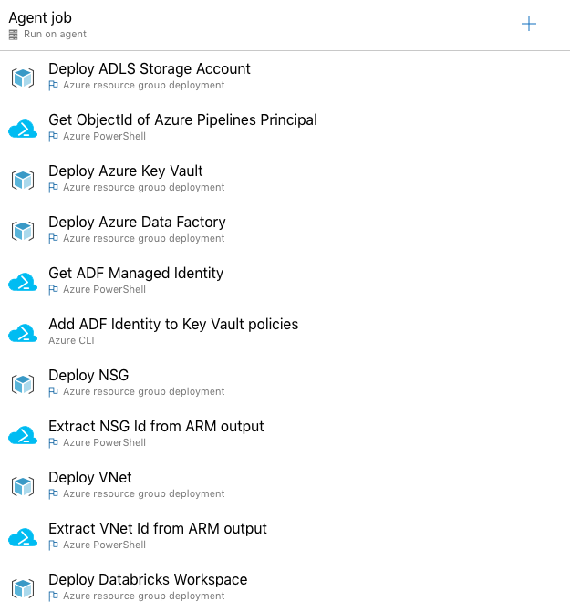
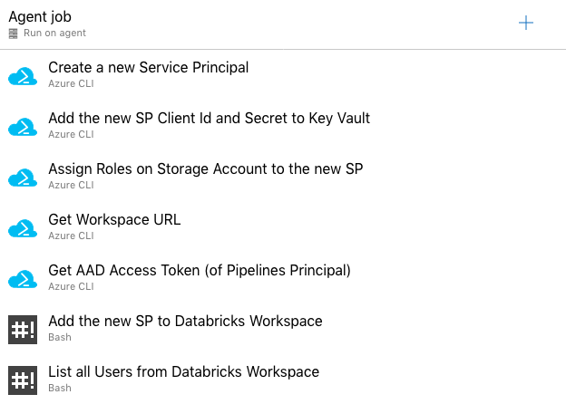
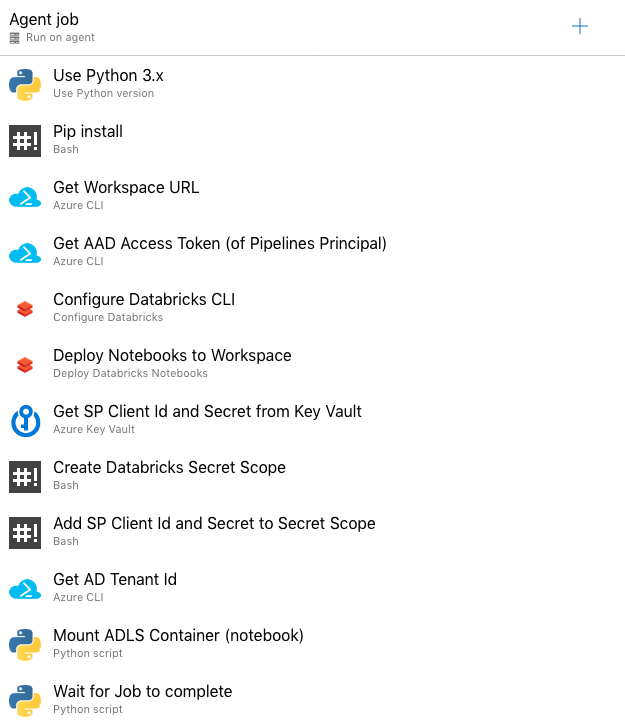
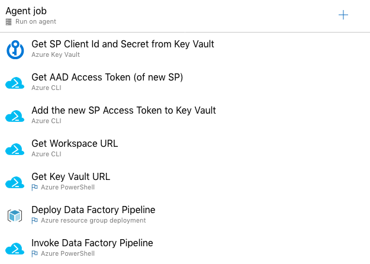
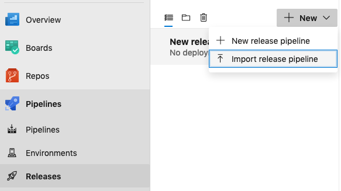
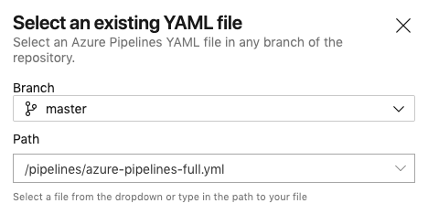
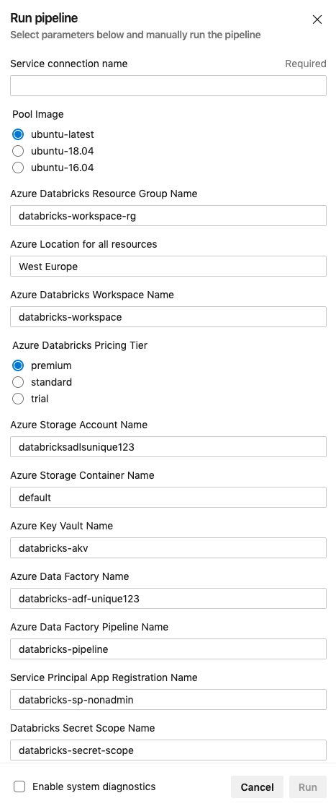

# azdo-databricks

-----------

This project contains examples of Azure DevOps (azdo) [Pipelines](https://docs.microsoft.com/en-us/azure/devops/pipelines/get-started/what-is-azure-pipelines) that demonstrate how an end-to-end Azure Databricks Workspace automation could be done:

1. Deploys the basic Azure Infrastructure and Databricks Workspace with [ARM templates](https://docs.microsoft.com/en-us/azure/azure-databricks/quickstart-create-databricks-workspace-resource-manager-template).
2. Creates a new Service Principal and adds it to the Workspace using the [SCIM API](https://docs.microsoft.com/en-us/azure/databricks/dev-tools/api/latest/scim/scim-sp). This SP will be used to mount the ADLS container and by Data Factory to launch the Notebook job.
3. Bootstraps / Setups the Workspace (deploys Notebooks, creates Secret Scope - to hold the SP details previously created, mounts ADLS storage - using the SP details from the Secret Scope).
4. Deploys a Data Factory Pipeline with a Databricks Notebook activity and triggers it. The Pipeline would use an AAD Token saved in AKV to login to the Databricks Workspace and launch a Notebook Job.

It is provided in both Pipeline formats:

- Classic interface ([doc](https://docs.microsoft.com/en-us/azure/devops/pipeline:s/get-started/pipelines-get-started?view=azure-devops#define-pipelines-using-the-classic-interface)): [pipelines/azure-pipelines-classic.json](pipelines/azure-pipelines-classic.json)
- YAML syntax ([doc](https://docs.microsoft.com/en-us/azure/devops/pipelines/get-started/pipelines-get-started?view=azure-devops#define-pipelines-using-yaml-syntax)): [pipelines/azure-pipelines-full.yml](pipelines/azure-pipelines-full.yml)

## [Design decisions](id:design)

This project does not attempt to show best practices, but to give an idea about what is possible. Azure Pipelines offers a lot of flexibility and 3rd party integrations so you should simply adapt to your own best practices.

For example:

- It deploys Infrastructure using multiple ARM templates, in an iterative way. A best practice would be to use [linked templates](https://docs.microsoft.com/en-us/azure/azure-resource-manager/templates/linked-templates).
- It only uses Service Principals and AAD Tokens - which expire in 1 hour (PATs are not used here).
- It sometimes uses scripts instead of easier 3rd party tasks such as [Data Thirst](https://marketplace.visualstudio.com/items?itemName=DataThirstLtd.databricksDeployScriptsTasks). This is just to show how the API calls would look like and you should use another integration if it makes sense.
- It uses a variety of scripts, mainly Bash with Azure CLI but also PowerShell and a couple of Python scripts. This is to show how you can pick the right tools and mix them in Pipelines, but a best practice would be to standardize around a single tool.

## [Pipeline Stages](id:stages)

These are easier to show using the Classic visual interface:

The `Artifact` in the screenshot above is this repository, and it contains the required files, such as ARM templates, Scripts and Notebooks.

### [Stage 1: Deploy Infrastructure](id:stage1)

This stage first deploys a simple Azure Infrastructure: Storage Account, Key Vault, Data Factory.

Then it deploys a custom VNet and the Azure Databricks workspace in this VNet. The process is described in the [documentation](https://docs.microsoft.com/en-us/azure/databricks/administration-guide/cloud-configurations/azure/vnet-inject#advanced-configuration-using-azure-resource-manager-templates).

The templates are similar to the ones from the Azure Quickstart Templates repo:

- [101-databricks-vnet-for-vnet-injection](https://github.com/Azure/azure-quickstart-templates/tree/master/101-databricks-vnet-for-vnet-injection)
- [101-databricks-workspace-with-vnet-injection](https://github.com/Azure/azure-quickstart-templates/tree/master/101-databricks-workspace-with-vnet-injection)

An important mention is that the NSG is created from an ARM template which contains the NSG rules that Azure Databricks creates after deployment.

Without these rules statically defined in the template, the deployment is not idempotent (it fails on subsequent deployments due to conflicts with NetworkIntentPolicy).
This might not be the best option for your environment as the major drawback is that you'll have to maintain these rules in the template whenever Databricks updates them.

An alternative would be to deploy the NSG separately and only reference it in the template.

### [Stage 2: Deploy Service Principal](id:stage2)

This stage creates a Service Principal using the [Azure CLI](https://docs.microsoft.com/en-us/cli/azure/ad/sp?view=azure-cli-latest#az-ad-sp-create-for-rbac) and adds the SP Client Id and Secret to the Key Vault.

It assigns permissions to the resources this SP needs to use (Storage Account).

It then adds this new SP to the Azure Databricks workspace, as a non-admin SP, using the [SCIM API](https://docs.microsoft.com/en-us/azure/databricks/dev-tools/api/latest/scim/scim-sp#add-service-principal).

### [Stage 3: Setup Workspace](id:stage3)

In this stage, the Notebooks are deployed to the Databricks Workspace using a simple databricks cli integration by [Microsoft DevLabs](https://marketplace.visualstudio.com/items?itemName=riserrad.azdo-databricks).

It then retrieves the SP credentials from the Key Vault previously created, creates a Databricks Secret Scope and adds those credentials to the Secret Scope.

Lastly, it mounts an ADLS Gen 2 container with a Notebook Job using the [Runs Submit API](https://docs.databricks.com/dev-tools/api/latest/jobs.html#runs-submit) and the credentials from the Secret Scope previously created.

### [Stage 4: Run a Pipeline](id:stage4)

In this stage, the SP credentials are retrieved from the Key Vault previously created and then they are used to login to Azure and generate an AAD Token which is stored in the Key Vault (to be used by the Data Factory Pipeline).

Then a Data Factory Pipeline is created (with an [ARM template](arm/azure-data-factory-pipeline.json)) and started from PowerShell. The Pipeline would run a Databricks Notebook activity with a Notebook path passed as parameter.

## [Using the pipeline](id:usage)

### [Setup Azure DevOps](id:setup)

Azure DevOps Pipelines connects to Azure to use the Azure Resource Manager and for this it needs a [Service Connection](https://docs.microsoft.com/en-us/azure/devops/pipelines/library/connect-to-azure).

It can be configured automatically or you can use an [already created Service Principal](https://docs.microsoft.com/en-us/azure/devops/pipelines/library/connect-to-azure?view=azure-devops#create-an-azure-resource-manager-service-connection-with-an-existing-service-principal). The main aspect is that this Service Principal will be the admin user in the Databricks Workspace.

This Service Principal also requires the permissions to deploy the Infrastructure and other Service Principals. These should be:

- On the Subscription (or Resource Group if already provisioned): `Contributor` and `User Access Administrator` roles
- On the AD Tenant: `Global administrator` role

### [Import the Classic pipeline](id:import-classic)

The [azure-pipelines-classic.json](pipelines/azure-pipelines-classic.json) file contains a sanitized Classic pipeline which can be imported in Azure Release Pipelines.

Go to `Pipelines` -> `Releases`, select `Import release pipeline` and give it this file (if you don't have any release pipelines you might have to create a new empty one to see this option):

Then configure the pipeline with an Artifact (should be a repository similar with this one) and all of the other settings that need attention (these should only be the Agent Pool config - use Ubuntu and the Service Connection).

Change the variables as required. The defaults should suffice but check the variables referencing a location as they will expect the artifact to be called `repo`.

### [Import the YAML Pipeline](id:import-yaml)

The [azure-pipelines-full.yml](pipelines/azure-pipelines-full.yml) file contains a YAML pipeline which can be imported in Azure Pipelines.

Go to `Pipelines`, select `Create Pipeline`, select your repo, then select `Existing Azure Pipelines YAML file` and use `/pipelines/azure-pipelines-full.yml` as the path:

Select `Save` under the `Run` menu and now when you select `Run pipeline` you should see all its options. Make sure you set the `Service connection name` to the name of the `Service Connection` you want to use. This can be found under `Project Settings` -> `Pipelines` -> `Service connections`:

